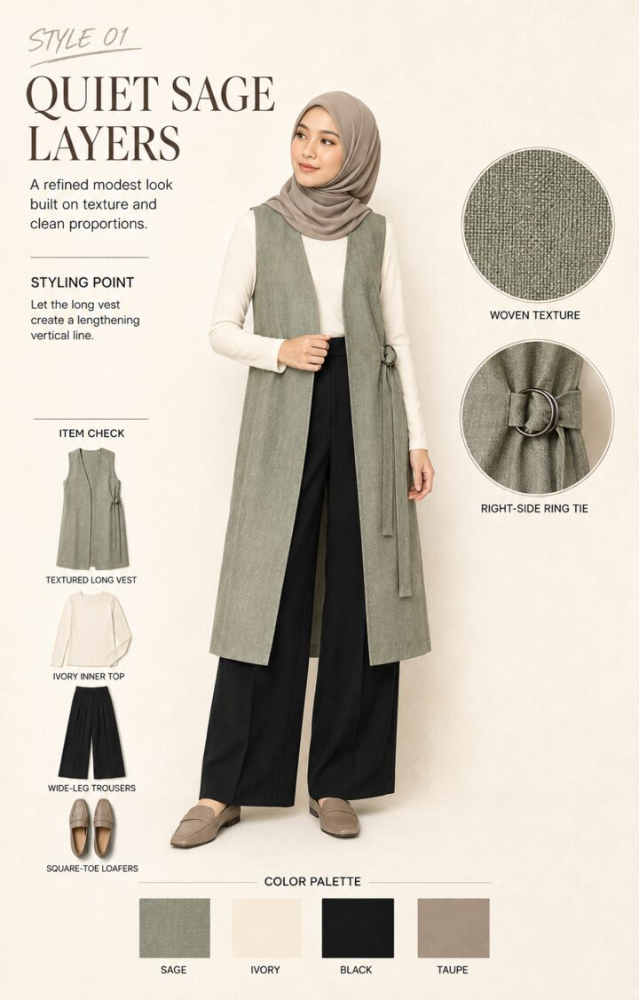
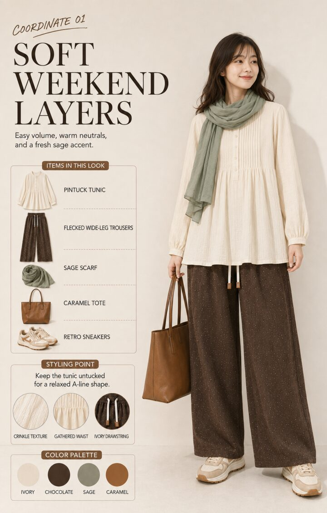
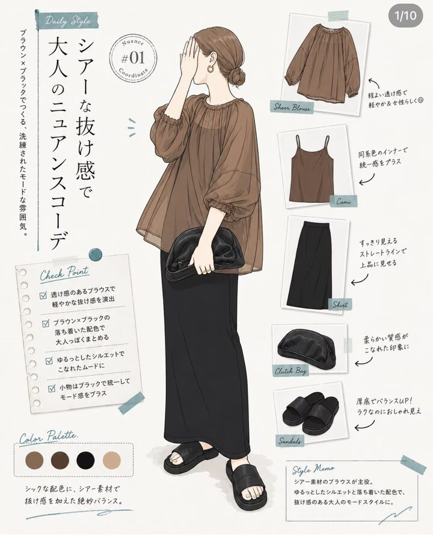
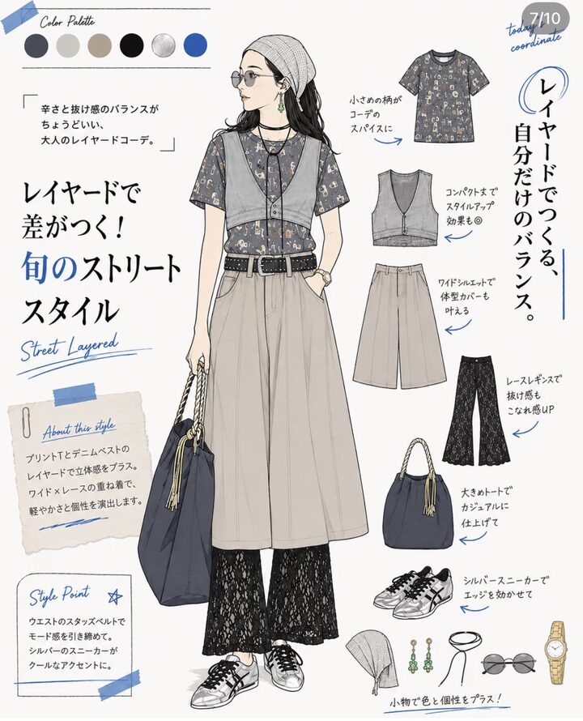
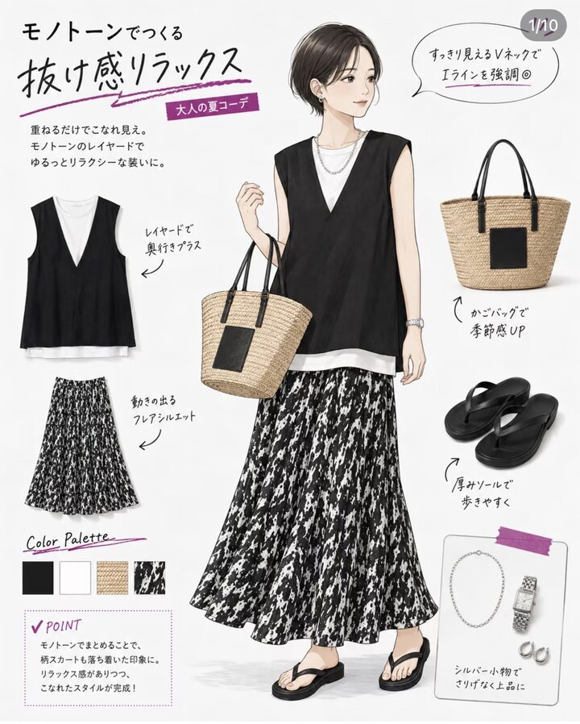
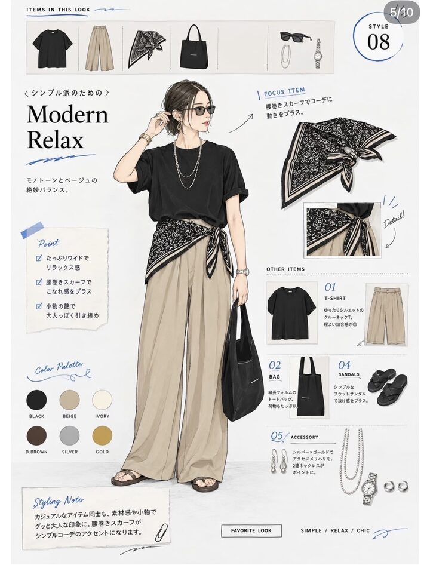
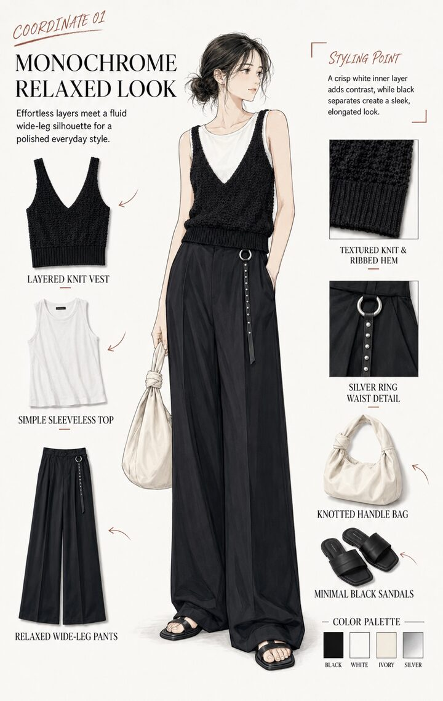
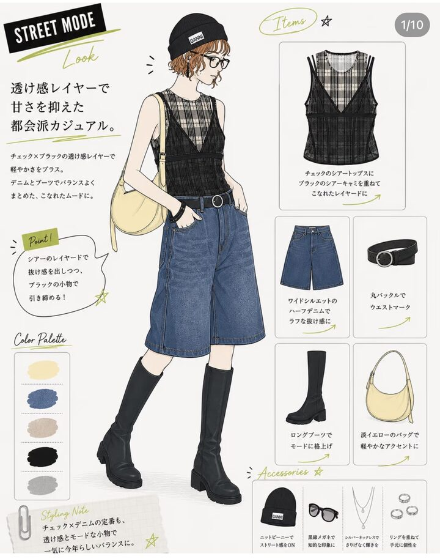
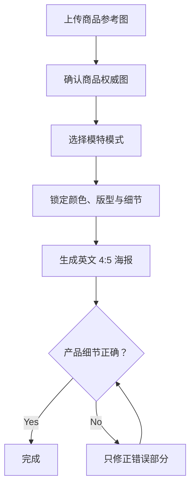

<div align="center">
  

# Fashion Coordinate Poster

**把服装参考图转换成写实、产品准确的英文 4:5 穿搭海报。**  
Create realistic, product-accurate English 4:5 fashion styling posters from reference images.

支持 Chinese、Korean、Malay Hijab 模特模式，并严格锁定服装颜色、版型、材质、裤型、腰头、口袋、抽绳和配件。
</div>

---

## 能做什么 / What it does

| 功能 | 说明 |
|---|---|
| 真人写实海报 | 自然皮肤、真实布料和商品摄影质感，减少 AI 味 |
| 严格产品还原 | 参考商品图优先，不能擅自改变颜色、剪裁、裤型或细节 |
| 三种模特模式 | Chinese、Korean、Malay Hijab |
| 电商友好 | 默认英文、4:5，适合 Shopee、TikTok、Instagram |
| 多种版式 | Editorial Detail、Item Check、Mix & Match、Focus Item |
| 细节检查 | 单独核对裤腰、抽绳、口袋、裤脚、纹理、五金与层次 |

## 成品示例 / Example posters

<table>
  <tr>
    <td width="50%" align="center">
      <br>
      <strong>Malay Hijab — Quiet Sage Layers</strong><br>
      真人模特、完整遮盖、面料与五金细节展示
    </td>
    <td width="50%" align="center">
      <br>
      <strong>Chinese / Korean — Soft Weekend Layers</strong><br>
      自然真人质感、单品拆解、细节特写与配色
    </td>
  </tr>
</table>

> 这些图片用于展示海报结构与视觉方向。实际生成时，用户上传的商品图仍然拥有最高优先级。

## 日系手绘风格库 / Japanese Editorial Style Library

将来只要指定 `Japanese Editorial Illustration`、`日系手绘穿搭解析` 或 `fashion magazine illustration`，Skill 就会参考这一组视觉方向。所有日文默认转换成简洁英文。

<table>
  <tr>
    <td width="33%" align="center"><br><strong>Daily Coordinate</strong></td>
    <td width="33%" align="center"><br><strong>Street Layered</strong></td>
    <td width="33%" align="center"><br><strong>Monochrome Skirt</strong></td>
  </tr>
  <tr>
    <td width="33%" align="center"><br><strong>Focus Accessory</strong></td>
    <td width="33%" align="center"><br><strong>Monochrome Editorial</strong></td>
    <td width="33%" align="center"><br><strong>Street Mode</strong></td>
  </tr>
</table>

> 这些图片只决定画风、版式、批注方式和信息密度。实际服装必须严格按照用户上传的商品权威图，不能复制风格图里的服装或配件。

使用示例：

```text
@Fashion Coordinate Poster
Use my uploaded product images as the sole product authority.
Create an English 4:5 Japanese Editorial Illustration poster.
Use refined adult fashion line art, soft watercolor or marker shading,
product cards, styling notes, handwritten arrows and a color palette.
Strictly preserve the exact garment and trouser construction.
```

## 图解工作流程 / Visual workflow



> 商品参考图是产品事实来源。其他海报只能参考布局、字体与信息密度，不能改变商品。

## 安装 / Installation

### 方法一：让 Codex 自动安装（推荐）

在 Codex 输入：

```text
$skill-installer Install the fashion-coordinate-poster skill from
https://github.com/pusatpakaiankime-bit/fashion-coordinate-poster
```

安装后用 `$fashion-coordinate-poster` 调用。

### 方法二：Windows PowerShell 手动安装

```powershell
git clone https://github.com/pusatpakaiankime-bit/fashion-coordinate-poster.git "$HOME\.agents\skills\fashion-coordinate-poster"
```

以后更新：

```powershell
git -C "$HOME\.agents\skills\fashion-coordinate-poster" pull
```

### 方法三：macOS / Linux

```bash
git clone https://github.com/pusatpakaiankime-bit/fashion-coordinate-poster.git \
  ~/.agents/skills/fashion-coordinate-poster
```

更新：

```bash
git -C ~/.agents/skills/fashion-coordinate-poster pull
```

### ChatGPT Desktop / Work

1. 在 GitHub 点击 **Code → Download ZIP**。
2. 打开 ChatGPT 的 **Skills**。
3. 导入下载的 Skill，或把 ZIP 上传后要求 `@skill-creator` 安装。
4. 新对话中输入 `@Fashion Coordinate Poster` 并上传商品图。

> Standalone skills are available in the ChatGPT desktop app, Codex CLI, and IDE extension. Web/mobile sharing should be packaged as a plugin for broader distribution.

## 最简单的使用方法

上传清晰的商品图，然后输入：

```text
@Fashion Coordinate Poster
Use the uploaded clothing image as the product authority.
Create a photorealistic English 4:5 fashion-coordinate poster.
Korean model. Real person and real product, natural skin and fabric,
strictly preserve the exact garment and trouser details.
```

## 中文用户提示词

### 韩国真人模特

```text
@Fashion Coordinate Poster
使用我上传的图片作为唯一商品标准。制作英文 4:5 穿搭海报。
使用韩国真人女模特，不要插画感，不要塑料皮肤，不要 AI 味。
严格保持衣服和裤子的颜色、剪裁、长度、面料纹理、腰头、抽绳及口袋。
```

### 华人真人模特

```text
@Fashion Coordinate Poster
制作英文 4:5 电商穿搭海报，使用年轻华人真人女模特。
商品必须严格按照上传参考图，不添加口袋、按钮、开衩或其他设计。
采用自然日光、真实皮肤和真实布料质感。
```

### 马来 Hijab 真人模特

```text
@Fashion Coordinate Poster
制作英文 4:5 穿搭海报，使用年轻马来穆斯林真人女模特。
Hijab 完整覆盖头发和颈部，造型简洁，不遮挡商品重点设计。
严格保持原商品版型与细节；如需要遮盖，只添加中性色贴身内搭，
不要把内搭描述为商品的一部分。
```

## 多张参考图怎样标记

```text
Image 1: Product authority — all garment details must follow this image.
Image 2: Back design reference.
Image 3: Fabric and waistband close-up.
Image 4: Layout inspiration only — do not copy its clothing.
```

优先级：

1. Product authority：决定商品真实颜色、剪裁和结构。
2. Detail reference：补充背面、面料、腰头或口袋。
3. Layout reference：只参考排版。
4. Series reference：只用于保持同一模特与视觉风格。

## 裤子特别锁定 / Trouser lock

裤子最容易被 AI 改错。提示中应明确：

- Straight、wide straight、palazzo、tapered、bootcut 或 flare。
- 腰头高度、松紧褶、抽绳数量、颜色、长度、出口和绳头。
- 是否有口袋；没有或不确定时，模特双手必须放在口袋外。
- 裤长、裤脚宽度、侧缝、纹理密度和垂坠感。

示例：

```text
Exact straight-leg trousers, not wide-leg, not bootcut, not flare.
Preserve the elastic waistband and one white drawcord.
No pockets. Keep both hands outside and show no pocket opening.
```

## 推荐输入图片

- 正面完整商品图
- 背面图
- 腰头与口袋近照
- 面料纹理近照
- 模特上身图
- 版式参考图（注明 layout only）

图片越清晰，商品还原越稳定。不要让低清版式参考图覆盖高清商品图。

## 输出前检查

- [ ] 所有文字都是英文且拼写正确
- [ ] 衣服与裤子颜色准确
- [ ] 领口、袖长、衣长和下摆正确
- [ ] 裤型、腰头、抽绳和口袋正确
- [ ] 面料纹理、图案比例和光泽正确
- [ ] 模特手部、脸部和身体比例自然
- [ ] Malay Hijab 模式完整遮盖头发和颈部
- [ ] 没有新增商品不存在的设计
- [ ] 画面是 4:5，主体完整可见

## 文件结构

```text
fashion-coordinate-poster/
├── SKILL.md
├── agents/
│   └── openai.yaml
├── assets/
│   └── icon.svg
└── references/
    ├── layouts.md
    └── model-modes.md
```

## 调用方式

- ChatGPT：输入 `@` 后选择 **Fashion Coordinate Poster**
- Codex CLI / IDE：输入 `$fashion-coordinate-poster`，也可用 `/skills`
- 自动触发：当请求涉及服装参考图、4:5 穿搭海报、商品细节锁定或三种模特模式时，Skill 可以自动启用

## 官方参考

- [OpenAI — Build skills](https://learn.chatgpt.com/docs/build-skills)
- Skill 必须包含带 `name` 与 `description` 的 `SKILL.md`。
- Codex 用户级 Skill 目录是 `$HOME/.agents/skills`。
- 可通过 `$skill-installer` 从其他 GitHub 仓库下载 Skill。

---

Made for realistic fashion e-commerce poster workflows.
